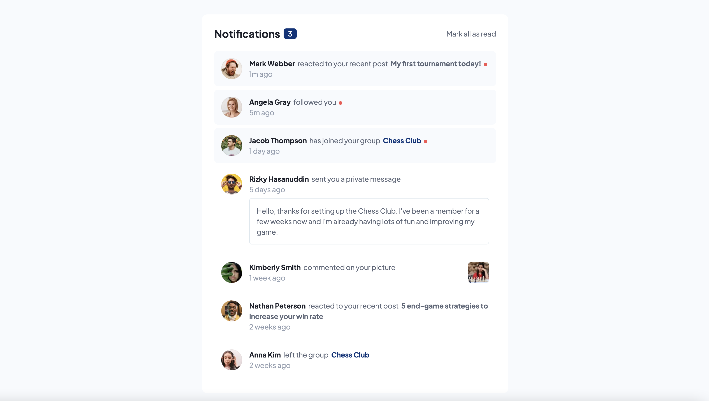

# Frontend Mentor - Notifications page solution

This is a solution to the [Notifications page challenge on Frontend Mentor](https://www.frontendmentor.io/challenges/notifications-page-DqK5QAmKbC). Frontend Mentor challenges help you improve your coding skills by building realistic projects.

## Table of contents

- [Overview](#overview)
  - [The challenge](#the-challenge)
  - [Screenshot](#screenshot)
  - [Links](#links)
- [My process](#my-process)
  - [Built with](#built-with)
  - [What I learned](#what-i-learned)
- [Author](#author)

## Overview

### The challenge

Users should be able to:

- Distinguish between "unread" and "read" notifications
- Select "Mark all as read" to toggle the visual state of the unread notifications and set the number of unread messages to zero
- View the optimal layout for the interface depending on their device's screen size
- See hover and focus states for all interactive elements on the page

### Screenshot

### Links

- Solution URL: [https://github.com/maryam-nasir/fm-notifications-page](https://github.com/maryam-nasir/fm-notifications-page)
- Live Site URL: [https://fm-notifications-page-xi.vercel.app/](https://fm-notifications-page-xi.vercel.app/)

## My process

### Built with

- Semantic HTML5 markup
- Tailwind CSS
- Flexbox
- TypeScript
- [React](https://reactjs.org/) - JS library

### What I learned

I recently learnt TypeScript and thus tested my TS skills on this project.

## Author

- LinkedIn - [Maryam Nasir](https://www.linkedin.com/in/maryam-nasir/)
- Frontend Mentor - [@maryam-nasir](https://www.frontendmentor.io/profile/maryam-nasir)
- Twitter - [@maryamnasir555](https://twitter.com/maryamnasir555)
